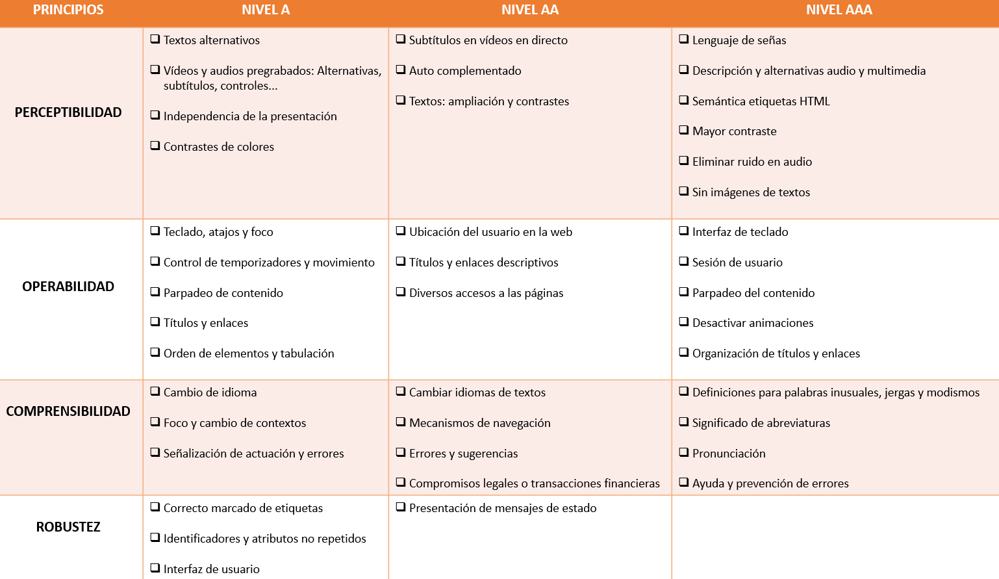

 # Pautas de Accesibilidad para el Contenido Web (WCAG)
 
- Real Decreto 1112/2018. Accesibilidad de los sitios web y aplicaciones para dispositivos móviles del sector público
- UNE-EN 301549:2022
  - Aplicaciones móviles
  - Sitios WEB
 
 ## WGAC 2.0, 2.1, 2.2
 
 https://guia-wcag.com/es/
 
 https://www.enmilocalfunciona.io/accesibilidad-web-wcag-pautas-directrices-y-validadores/
 
 WGAC 2.1: Principios (4) -> Pautas (13, 12 en 2.0) -> Criterios (78) -> Niveles CONFORMIDAD (3: A, AA, AAA, de menor a mayor exigencia). El mínimo en las Administraciones públicas es el nivel de conformidad AA (RD)
 

 
 ### Principios/ Fundamentos de accesibilidad
 - Principio 1: **Perceptible**: la información y los componentes de la interfaz de usuario deben ser mostrados a los usuarios en formas que ellos puedan entender
   - Pauta 1.1: **Alternativas textuales**: Proporcionar alternativas textuales para todo contenido no textual de modo que se pueda convertir a otros formatos que las personas necesiten, tales como textos ampliados, braille, voz, símbolos o en un lenguaje más simple.
   - Pauta 1.2: **Contenido multimedia dependiente del tiempo**: Medios tempodependientes: proporcionar alternativas para los medios tempodependientes.
   - Pauta 1.3: **Adaptable**: Crear contenido que pueda presentarse de diferentes formas (por ejemplo, con una disposición más simple) sin perder información o estructura.
   - Pauta 1.4: **Distinguible**: Facilitar a los usuarios ver y oír el contenido, incluyendo la separación entre el primer plano y el fondo.
 - Principio 2: **Operable**: Los componentes de la interfaz de usuario y la navegación debe ser manejable
   - Pauta 2.1: **Teclado accesible**: Proporcionar acceso a toda la funcionalidad mediante el teclado.
   - Pauta 2.2 **Tiempo suficiente**: Proporcionar a los usuarios el tiempo suficiente para leer y usar el contenido.
   - Pauta 2.3: **Ataques epilépticos**: No diseñar contenido de un modo que se sepa podría provocar ataques, espasmos o convulsiones.
   - Pauta 2.4: **Navegación**: Proporciona formas para ayudar a los usuarios a navegar, a buscar contenido y a determinar donde están estos.
   - **¡¡NOVEDAD 2.1!!** Pauta 2.5: **Modalidades de entrada**. Proporcionar medios para ayudar a los usuarios a navegar, encontrar contenido y determinar dónde se encuentran.
 - Principio 3: **Comprensible**. La información y las operaciones de usuarios deben ser comprensibles.
   - Pauta 3.1: **Legible**. Hacer que los contenidos textuales resulten legibles y comprensibles.
   - Pauta 3.2: **Previsible**. Hacer que las páginas web aparezcan y operen de manera predecible.
   - Pauta 3.3: **Asistencia**. Ayudar a los usuarios a evitar y corregir los errores.
 - Principio 4: **Robustez**: el contenido deber ser suficientemente robusto para que pueda ser bien interpretado por una gran variedad de agentes de usuario, incluyendo tecnologías de asistencia
   - Pauta 4.1: **Compatible**. Maximizar la compatibilidad con las aplicaciones de usuario actuales y futuras, incluyendo las ayudas técnicas.
 
  [🎹](https://www.youtube.com/watch?v=a_426RiwST8)
 
 ### Criterios A
- Contenido no textual. Perceptible. Alternativas textuales. Desactivar animaciones al usar el teclado. Cualquier contenido "no textual" que sea relevante para comprender la información, debe incluir una descripción de texto alternativo (visible o no) para identificar el contenido (incluido el captcha, por ejemplo).
- Sólo audio o sólo video (pregrabado). Perceptible. Contenido multimedia dependiente del tiempo. Se debe proporcionar una de las siguientes alternativas para el contenido presentado:
  - Sólo audio: proporcione transcripción de texto descriptivo
  - Sólo video: proporcione una transcripción de texto descriptivo y / o una pista descriptiva de audio que se pueda habilitar
- Subtítulos (pregrabados). Perceptible. Contenido multimedia dependiente del tiempo. Cualquier contenido pregrabado que contenga una pista de audio (ya sea sólo de audio o video) debe tener subtítulos
- Audiodescripción o Medio Alternativo (pregrabados). Perceptible. Contenido multimedia dependiente del tiempo. Se debe proporcionar una audiodescripción o una transcripción textual descriptiva para todo el contenido de video pregrabado
- Información y relaciones. Perceptible. Adaptable. La organización estructural de una pantalla debe construirse de tal manera que su arquitectura de información tenga sentido tanto para quienes ven como para quienes escuchan el contenido. Sugerencia: el desafío aquí es proporcionar experiencias equivalentes relacionadas con los contextos visuales y auditivos
- Secuencia significativa. Perceptible. Adaptable. Cualquiera que sea el método de interacción, la presentación de información en la pantalla siempre debe tener una secuencia lógica. Sugerencia: el contenido responsivo no debe afectar la comprensión de la información, independientemente del tamaño de la pantalla
- Características sensoriales. Perceptible. Adaptable. Cualquier tipo de instrucción o dirección no debe depender de un formato específico, ubicación espacial, sonido o cualquier otra característica sensorial. Ejemplo: evite expresiones como "haga clic en el botón de abajo" o "haga clic en el botón verde" o "cuando escuche un pitido, seleccione una opción"
- Uso de colores. Perceptible. Distinguible. Los colores no deben usarse como la única forma de transmitir contenido o distinguir elementos visuales
- Control de audio. Perceptible. Distinguible. Se debe proporcionar una forma sencilla de pausar, silenciar o ajustar el volumen de cualquier audio que se reproduzca automáticamente durante más de 3 segundos en la interfaz
- Teclado. Operable. Accesible por teclado. Toda la funcionalidad debe activarse a través del teclado, a menos que la funcionalidad no permita el control solo con el teclado
- Sin bloqueo de teclado. Operable. Accesible por teclado. Al interactuar a través del teclado, la navegación a través de todos los elementos en los que se puede hacer clic debe ocurrir sin ningún bloqueo o interrupción
- Métodos abreviados de teclado por carácter. ​**WGAC 2.1**. Operable. Accesible por teclado. Debe evitarse la creación de atajos de teclado utilizando solo caracteres simples (por ejemplo: letras o números) que pueden entrar en conflicto con los atajos existentes en el sistema. Si esto ocurre, se deben cumplir ciertas condiciones (consulte los criterios completos)
- Ajustable por límite de tiempo. Operable. Tiempo suficiente. Si se define una función que requiere tiempo para ejecutarse y no es imprescindible (obligatorio desde un punto de vista legal), también se debe incluir una opción para apagarla o una opción para expandirla
- Pausar, detener u ocultar. Operable. Tiempo suficiente. Cualquier elemento de la pantalla que tenga movimiento automático o parpadeo y que dure más de 5 segundos, debe tener un tipo de control donde la persona que lo usa pueda pausar, detener u ocultar
- Tres destellos o por debajo del límite. Operable. Ataques epilépticos. Ningún contenido de la página debe parpadear más de 3 veces por segundo, a menos que los flashes tengan poco contraste o poco rojo (consulte los criterios completos)
- Ignorar bloques. Operable. Navegable. Se debe proporcionar un tipo de control para que las personas puedan ignorar cierto contenido repetitivo (ejemplo: un menú de navegación)
- Página de título. Operable. Navegable. Todas las pantallas deben tener un título principal y describir claramente su propósito
- Orden de enfoque. Operable. Navegable. La interacción de los elementos enfocables en la pantalla debe ser siempre secuencial y lógica según el contenido presentado
- Objeto del enlace. Operable. Navegable. El propósito de un enlace debe determinarse a partir del texto del propio enlace o del contexto que lo rodea
- Foco visible. Operable. Navegable. Al interactuar con el teclado, cualquier persona debería poder identificar su ubicación espacial en la pantalla a través de un enfoque (visible) que identifique su ubicación
- Gestos de disparo. Operable. Modalidades de entrada. ​**WGAC 2.1**. Cualquier funcionalidad que requiera que se active una ruta táctil (ejemplo: arrastrar con el dedo en una pantalla táctil) también necesita un método alternativo que facilite la interacción de quienes no pueden realizar el gesto (ver criterios completos)
- Cancelación de puntero o de la activación. Operable. Modalidades de entrada. ​**WGAC 2.1**. Es posible que haya un clic o toque accidental en un determinado componente y si la persona lo nota (antes de soltar el botón pulsado o tocado), debe tener una forma de cancelar la activación accidental
- Etiqueta de nombre accesible. Operable. Modalidades de entrada. ​**WGAC 2.1**. Las etiquetas de los botones, los íconos accionables o cualquier control interactivo deben tener una descripción significativa tanto para quienes ven como para quienes acaban de escuchar la información
- Actuacion por movimiento. Operable. Modalidades de entrada. ​**WGAC 2.1**. Si hay una función que requiere que el dispositivo se mueva (ejemplo: "agitar para deshacer"), se debe ofrecer una forma de habilitarlo para que se apague para evitar una activación accidental. Si esta función es imprescindible, se debe ofrecer una activación alternativa
- Idioma de la página. Comprensible. Legible. Declarar correctamente el idioma de la pantalla hace que los lectores de pantalla usen una entonación correcta para citar el contenido. Declararlos siempre
- En Foco. Comprensible. Predecible. No se deben producir cambios contextuales que puedan desorientar a alguien desde el foco en cualquier elemento de la interfaz (ejemplo: abrir una ventana modal), sin confirmación directa (ejemplo: un botón de confirmación)
- Campo de entrada (Input). Comprensible. Predecible. No deben ocurrir cambios contextuales que puedan desorientar a alguien cuando hay una interacción en un campo de entrada de datos (ejemplo: elementos de formulario), sin confirmación directa (ejemplo: un botón de confirmación)
- Ayuda consistente. Comprensible. Predecible. ​​**WGAC 2.2**. Si se proporcionan algunas opciones de ayuda en una pantalla (ejemplo: datos de contacto humano), este mismo formato debe ser el mismo en todas las demás pantallas donde se proporciona ayuda
- Identificación de errores. Comprensible. Entrada de datos asistida. Siempre que se muestre un mensaje de error, debe identificar claramente qué elemento generó el error de forma visual y audible (ejemplo: cambio de color en el elemento + un icono de alerta + un mensaje de texto)
- Etiquetas e instrucciones. Comprensible. Entrada de datos asistida. Todas las etiquetas deben describir de forma clara e inequívoca el propósito de los campos del formulario
- Entrada redundante. Comprensible. Entrada de datos asistida. ​​**WGAC 2.2**. Al completar un formulario dividido en etapas, los datos ingresados deben solicitarse solo una vez durante el proceso, a menos que sea imprescindible (ejemplo: volver a ingresar una contraseña para su confirmación)
- Análisis (código). Robusto. Compatible. Debe proporcionarse un código semánticamente correcto y sin errores significativos
- Nombre, función, valor. Robusto. Compatible. Toda la tecnología de asistencia hace uso de las propiedades de nombre, función y valor para identificar correctamente los elementos estandarizados de HTML. Cualquier componente personalizado también debe traer estas marcas de manera adecuada

[🫦](https://www.youtube.com/watch?v=P4wheWr5hXw)

### Criterios AA
- Subtítulos (en vivo). Cualquier contenido en vivo que contenga una pista de audio (ya sea sólo de audio o video) debe tener subtítulo
- Audiodescripción (pregrabada). Medios tempodependientes. Se debe proporcionar una audiodescripción para todo el contenido de video pregrabado
- Orientación. ​**WGAC 2.1**. Ninguna funcionalidad debe depender de una orientación de pantalla específica (ejemplo: girar el teléfono horizontalmente), a menos que sea esencial para realizar la función
- Identificar el objetivo de entrada. ​**WGAC 2.1**. Las personas deben tener claro qué completar en los campos del formulario
- Contraste (mínimo). Los textos deben tener una relación de contraste entre el primer plano y el fondo de al menos 4.5:1 (consulte los criterios completos)
- Cambiar el tamaño del texto. Al hacer zoom hasta un 200% en la pantalla, la receptividad de los textos presentados debe ocurrir para que su lectura y legibilidad sean adecuadas sin ninguna interrupción en la presentación de la información
- Imágenes de texto. Cualquier extracto en pantalla que pueda mostrarse en formato de texto estilizado (ejemplo: una cita de una oración de un autor específico o el título de una sesión), no debe presentarse en formato de imagen, a menos que pueda ser personalizado por la persona
- Reflujo. ​**WGAC 2.1**. Al hacer zoom hasta un 400% en la pantalla, la información presentada debe responder para que no se produzca el desplazamiento horizontal. Los elementos deben adaptarse a la pantalla hasta el punto de evitar el desplazamiento vertical y horizontal
- Contraste no textual. ​**WGAC 2.1**. Los componentes de la interfaz (ejemplo: botones) y las imágenes esenciales para comprender el contenido deben tener una relación de contraste entre el primer plano y el fondo de al menos 3:1
- Espaciado de texto. ​**WGAC 2.1**. Siempre que las personas realicen ajustes y redimensionen (por su cuenta) los textos de un contenido a algunos valores específicos (ver criterios completos), no debería haber pérdida de legibilidad de la información presentada
- Contenido al pasar el mouse o teclado o al hacer foco. ​**WGAC 2.1**. El contenido adicional (ejemplo: información sobre herramientas o submenú) no debe activarse con el foco solo con el mouse (mouseover) o el teclado. Si esto ocurre, se deben cumplir ciertas condiciones (consulte los criterios completos)
- Varias formas. Las personas siempre deben tener más de una opción para encontrar un contenido en particular
- Encabezados y etiquetas. Todos los títulos (diferentes niveles) y etiquetas (campos de formularios) deben describir claramente el propósito de los contenidos o agrupaciones en los elementos de la pantalla, sin ambigüedad en su comprensión
- Aspecto del foco. ​​**WGAC 2.2**. Cuando se muestra el foco visible, debe tener un área de 1 píxel, debe haber un espaciado mínimo entre el contenido y la relación de contraste con las áreas adyacentes debe ser suficiente (ver criterio completo)
- Foco no oscurecido (mínimo). ​​**WGAC 2.2**. Cuando se muestra un foco visible en algún elemento de la interfaz, no se puede ocultar por completo debido a otros componentes de la interfaz (ejemplo: un pie de página fijo cubre parcialmente este elemento)
- Movimientos de arrastre. ​​**WGAC 2.2**. Cualquier funcionalidad que dependa de un movimiento de arrastrar y soltar también debe recibir un método de uso alternativo para que la operación también se lleve a cabo haciendo clic o tocando
- Tamaño del área en la que se puede hacer clic (mínimo). ​​**WGAC 2.2**. El tamaño de las áreas en las que se puede hacer clic o tocar debe tener una separación mínima de 24x24 píxeles. El área puede ser más pequeña en algunos casos, como cuando hay un espacio de al menos 24 píxeles para las áreas activas adyacentes
- Idioma de las partes. El idioma de una palabra o frase en particular que contenga un idioma diferente al original en la pantalla, debe estar definido e identificado correctamente para que también se produzca la entonación correcta y la pronunciación adecuada a través de lectores de pantalla
- Navegación consistente. Se debe mantener la coherencia en cuanto al formato de presentación, interacción y ubicación en pantalla, siempre que los mismos elementos (ejemplo: un campo de búsqueda) se muestren en diferentes pantallas que formen parte de la misma aplicación (sitio web o app)
- Identificación coherente. Se debe mantener la consistencia con respecto a diferentes formatos de elementos, pero que tienen la misma funcionalidad (ejemplo: un icono y un botón para descargar algo), aumentando la capacidad cognitiva de algunas personas
- Error sugerido. Siempre que se muestre un mensaje de error, también debe dar consejos sobre cómo resolver el error (no basta con indicar que se ha producido un error)
- Prevención de errores (legales, financieros, de datos). Se deberá aportar un formulario de confirmación de datos o la posibilidad de cancelar el envío, siempre que los campos del formulario requieran la cumplimentación de datos que impliquen responsabilidad legal, económica o contengan datos sensibles
- Autenticación accesible. ​​**WGAC 2.2**. Las funciones que facilitan la escritura de contraseñas en los campos de inicio de sesión (ejemplo: posibilidad de copiar y pegar) no deben eliminarse sin que exista una justificación coherente para su eliminación
- Mensajes de estado. ​**WGAC 2.1**. Cualquier tipo de mensaje que sea resultado de una acción o que informe el avance de un proceso y que sea relevante para la persona, debe transmitirse sin un cambio de contexto (foco) en la pantalla

[🖤](https://www.youtube.com/watch?v=huErRAK1ch0)

### Criterios AAA
Pasando por ahora<no mirar>
 
# TAW  
TAW es un conjunto de herramientas para el análisis de la accesibilidad de sitios web.
El objetivo es comprobar el nivel de accesibilidad que cumple un sitio web con el fin de permitir el acceso a todas las personas independientemente de sus características diferenciadoras.
 
## TAW Web
Servicio online que permite revisar la accesibilidad de una determinada URL. Genera un informe resumen basado en la página analizada con información sobre el resultado de la revisión. Además, puedes recibir un informe completo en tu dirección de email.
Soporta: WCAG 2.1 UNE-EN 301549 
 
## TAW Monitor
El TAW Monitor es un sistema que permite la revisión desatendida de los sitios de Internet, en el que se analizan de forma periódica y sin hacer falta intervención un conjunto de portales, emitiendo informes de estado y alertas por diferentes canales.
Soporta: WCAG 2.1 UNE-EN 301549 
 
## TAW CMS
Ahora puedes integrar el analizador de accesibilidad TAW en el editor de contenidos del CMS. Ya no hace falta esperar a publicar la página para poder comprobar su grado de accesibilidad.
El nuevo servicio web de TAW permite cómodamente integrar la opción de análisis durante la edición de contenidos y analizar los contenidos antes de que se publiquen.
Actualmente existen módulos para su uso en el editor FCKEditor y en el editor TinyMCE.
Soporta: WCAG 2.1 UNE-EN 301549 
 
## TAW Standalone
La versión descargable del TAW es una aplicación de escritorio para el análisis automático de sitios web basándose en las Pautas de Accesibilidad al Contenido Web 1.0 (WCAG 1.0). TAW3 sigue los enlaces de los documentos HTML de forma que permite analizar desde una única página hasta sitios web completos.
- Windows
- MacOS X
- Unix, Linux, AIX, Solaris, HPUX

## TAW Observatory
Hemos desarrollado una herramienta de análisis sobre una plataforma distribuida basada en tecnología de “Grid Computing”, con una capacidad de análisis muy elevada. Está dirigida a la realización de observatorios, en los que el volumen de sitios web y páginas que se revisan puede ser muy alto. Esta herramienta integra el motor de análisis del TAW, además de otros analizadores de calidad web (gramáticas, movilidad, calidad, etc.)
Basado en esta herramienta, podemos realizar observatorios para conocer el estado de la accesibilidad de un conjunto de portales lo que permite conocer el detalle de cumplimiento de los portales para abordar, por ejemplo, una estrategia de mejora de los sitios web implicados.
Hemos realizado observatorios de este tipo tanto en España como en Iberoamérica (Chile, México, Uruguay)
Soporta: WCAG 2.1 UNE-EN 301549 

##MERKUR
Derivado de la accesibilidad y tomando como base las Buenas prácticas de movilización de contenidos de W3C, las cuales están relacionadas en bastantes aspectos con la accesibilidad, hemos desarrollado MERKUR, herramienta que permite transformar un sitio web no móvil haciéndolo compatible con todo tipo de dispositivos móviles y tablets. La herramienta aprovecha la accesibilidad de sitio web, en su caso, para avanzar más rápidamente en el proceso de movilización

## Guías e informes técnicos
ATAG: Authoring Tool Accessibility Guidelines
UAAG: User Agent Accessibility Guidelines
XAG: XML Accessibility Guidelines 
WAI-ARIA: Accessible Rich Internet Applications
 

[💭💤](https://www.youtube.com/watch?v=Rn1Fvb_fiSI)
